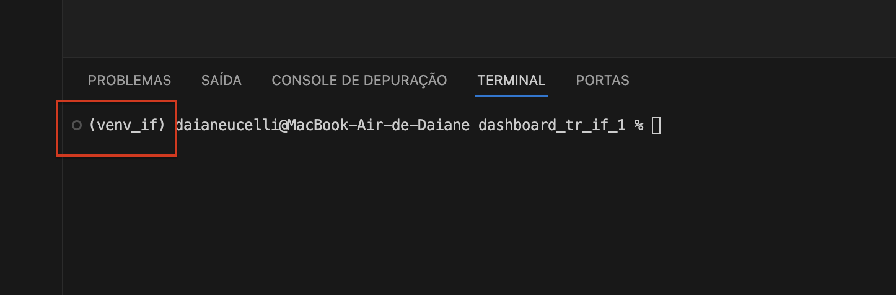

# Configurando um ambiente Python (env):

1. Qual a importância de ter um ambiente Python criado no diretório do seu projeto?

A resposta mais simples é: isolar o ambiente criado de todo o ecossistema Python que existe na sua máquina. Fazemos isso porque projetos diferem entre si e utilizam bibliotecas diferentes para cada finalidade. Portanto, não seria necessário, por exemplo, tem uma biblioteca voltada para Ciência de Dados em um diretório/repositório em que estamos trabalhando com Análise de Dados. 

Outro ponto é que em alguns projetos, utlizamos uma versão específica do Python ou até mesmo das bibliotecas utilizadas, essas que estão em constante desenvolvimento e atualizações, e o que você está usando agora - neste projeto, por exemplo - pode sofrer uma alteração crítica numa dessas atualizações e caso você atualize a versão de algumas dessas, essa funcionalidade mude e isso pode quebrar o seu código. Dito isso, é importante isolar seu projeto do ecossistema como um todo. 

Estamos partindo do ponto em que o Python esteja corretamente instalado em sua máquina, para isso é fácil verificar abrindo um novo prompt de comando e digitar: python ou python3, vai depender do Sistema Operacional utilizado. Se estiver tudo certo, a versão mais recente do Python instalado em sua máquina, vai ser vista na resposta à linha de comando, assim: 


No momento que escrevo esse texto a versão mais atual do Python é a 3.12 (que é a que estou usando aqui).

## Criando um repositório: 

Vamos criar um repositório para guardar todo o progresso e conseguir fazer o versionamento do nosso código. Utilizo o git, mas existem outras ferramentas para o mesmo propósito. 

Para usar o git, é necessário instalar e configurar em sua máquina, aqui mais uma vez dependeremos do Sistema Operacional pois os comandos variam um pouco. 

[Link para baixar o git!](https://git-scm.com/)

Na documentação do Git existe um passo a passo de como configurá-lo, o processo é bem simples.

[Configurando o git!](https://git-scm.com/book/pt-br/v2/Come%C3%A7ando-Configura%C3%A7%C3%A3o-Inicial-do-Git)

Caso dê tudo certo com aconfiguração, conseguimos checar via prompt de comando, digitando: git config --list


Agora já podemos nos comunicar com a nossa conta do Github.

Esse [artigo](https://www.alura.com.br/artigos/o-que-e-git-github?utm_term=&utm_campaign=&utm_source=adwords&utm_medium=ppc&hsa_acc=7964138385&hsa_cam=20946398532&hsa_grp=153091871930&hsa_ad=688089973825&hsa_src=g&hsa_tgt=dsa-2258482181163&hsa_kw=&hsa_mt=&hsa_net=adwords&hsa_ver=3&gad_source=1&gclid=CjwKCAiA0bWvBhBjEiwAtEsoW0t-PSP9Mgd-F3tu1thxSKX7ocPFAqc4HAv6zHXtgc62runFJpf9-RoCcg8QAvD_BwE) é bem interessante para entender como essa comunicação é feita. 

Bom, existem várias maneiras de criar um repositório e ir versionanmento o código. Eu vou mostrar uma bem simples e que funcionará para o que queremos fazer. 

1. Crie um repositório diretamente na interface do [Github](https://docs.github.com/pt/repositories/creating-and-managing-repositories/quickstart-for-repositories). 
 - Você vai entrar em sua conta e criar esse repositório vazio (como no tutorial da documentação do Github acima), com um arquivo readme e eu recomendo que deixe esse repositósio privado. Vamos trabalhar com dados e provavelmente dados sensíveis que não queremos expor (ainda). 

 - Como o repositório criado, vamos clonar o repositório vazio para nossa máquina com o comando: git clone <link do repositório criado>. Você vai acessar o link HTTPS do repositório pela interface do Github. Assim:

 

 Há várias maneiras de fazer esse clone do projeto, via HTTPS como aqui, via SSH, via CLI, via github desktop. Esse mostrado aqui funciona bem e não é complexo. 

 ## Criando o Ambiente Virtual Python para o Projeto. 

 Para criar um ambiente Python, abra o seu projeto dentro do VSCode, abra um novo terminal pelo próprio VSCode e rode o comando*:

 *nome_ambiente_virtual vai ser o nome do seu ambiente. Ex: env, venv, venv_nomedoprojeto. 

 substitua nome_ambiente_virtual, pelo nome do ambiente que você quer criar. 


```bash

python3 -m venv nome_ambiente_virtual

```


com o ambiente criado, precisaremos ativá-lo. Ainda no terminal do próprio VSCode, vamos ativar o ambiente com um comando específico para cada SO. 

No MAC ou Linux: 

```bash
source nome_ambiente_virtual/bin/activate

```

No Windows:

```bash
nome_ambiente_virtual/Scripts/Activate
```

Se o ambiente virtual for ativado com sucesso, será possível ver no terminal o nome_ambiente_virtual entre parênteses, assim, por exemplo: 

 


## Gerenciando pacotes usados no seu projeto: 

Uma maneira simples de gerenciar todos os pacotes Python que utilizará em seu projeto, é criando um arquivo e o renomeando para requirements.txt. Desse maneira, você pode simplesmente listar todos os pacotes que quer instalar. 

 

 Você também pode especificar o versão do pacote que está usando. Aqui você pode ir atualizando os pacotes conforme for precisando/criando novos. 

 Para instalar, salve o arquivo (ctrl+S/cmd+S), e rode o comando a seguir, no mesmo terminal já aberto anteriormente e com a venv ativada! Isso vai garantir que todos os seus pacotes estarão sendo instalados somente nesse ambiente e que nenhum outro ambiente do seu Python local será afetado por eles. 

MAC ou Linux: 


```bash
pip3 install -r requirements.txt
```

No Windows:

```bash
pip install -r requirements.txt
```

Aguarde a instalação. E o ambiente estará pronto pra uso. 

## Controle de Código Via Interface do VSCode: 

Uma maneira fácil de salvar as alterações do seu arquivo via git dentro do próprio VSCode é ir em controle de código:

 

 1. Digitar a mensagem daquele commit (obrigatório), 
 2. clicar no botão de Preparar todas as alterações (obrigatório),
 3. clicar em Confirmação (nesse ponto todos as alterações estão preparadas para "subir" para o Github)
 


4. ir em Modos de Exibição e Mais ações (mais conhecido como 3 pontinhos rs) e clicar em Enviar por push. 


Pronto! Suas alterações estarão todos no seu repositório do Github. 


